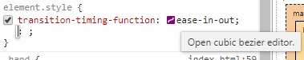
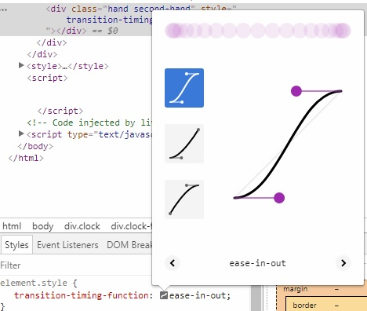

**CH02 JS and CSS Clock**
=============

1. 使用```transform: rotate(**deg)```的時候會以元素的正中間為中心旋轉，所以要加上```transform-origin: 100%```告訴他以最右邊為中心 (預設transform-origin是50%)

&nbsp;

2. dev tool中使用```transition-timing-functiong```屬性後隨便選一個預設的function後點icon可以進入界面自訂cubic bezier



&nbsp;

3. 一開始用了```transform: rotate(90deg);```為了把水平線改成垂直線才像指針，所以要對上時間要把算出來的角度+90 (```const secondsDegrees = ((seconds / 60) * 360) + 90;```)

4. ```getHours()```是24小時制所以要除以12
