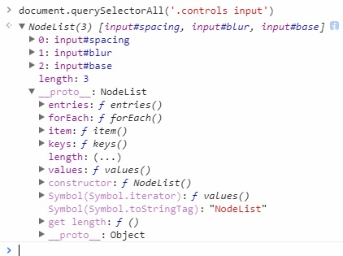
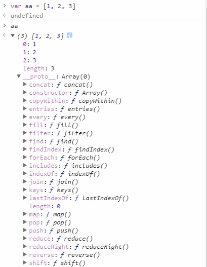

**CH03 Playing with CSS Variables and JS**
=============

1. CSS可以也可以用變數存取屬性值，SASS是用$、CSS是用--宣告變數名稱，然後用```var(--變數名稱)```使用
2. ```querySelectorAll()```得到的是像Array的NodeList型別，明顯的差別在於NodeList內建可以使用的方法比較少<br>

3. css variable越靠近指定元素優先度會越高