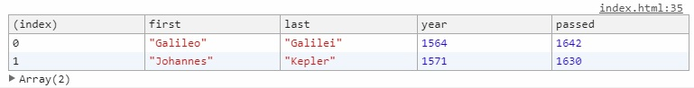

**CH04 Array Cardio Day 1**
=============

1. ```console.table()```可以在Dev Tool以表格的方式顯示資料<br>
2. ```reduce``` 第一個參數是加總的參數，function後是帶預設值
3. ```querySelector```出來的元素可以再次使用querySelector
4. NodeList沒有map這個function，需要轉成Array型態，[ES5]```Array.from(NodeList)```、[ES6 Spread syntax] ```[...NodeList]```
5. 判斷字串包含內容可以用```indexOf(text) !== -1```或```includes(text)```