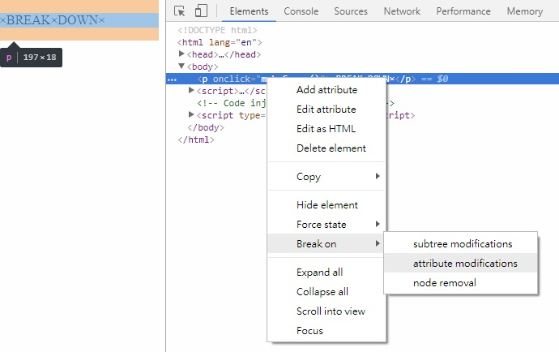
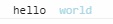
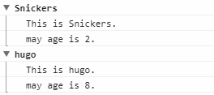

**CH09 14 Must Know Dev Tools Tricks**
=============

1. 元素監聽事件，找到要監聽的元素右鍵 → Break on → attribute modifications <br>
2. ```console.log```中插入字串可以用```console.log('hello %s string', 'word');```(ES6 template string比較好用)
3. ```console.log```中使用CSS可以用```console.log('hello %c world', 'color:lightblue');```，**CSS的影響範圍是%c以後的字串**<br>
4. ```console.assert```用在測試，錯誤時才會log在devtool上的console
5. ```console.clear()```清除devtool console中全部log，熱鍵```CTRL + L```
6. ```console.dir(element)```瀏覽dom properties
7. 替一段log做分群，```console.group()```分群起點，```console.groupEnd()```分群終點，```console.groupCollapsed()```分群起點(預設把分群關起來)<br>
8. ```performance.now()```返回一個時間戳記，兩個```performance.now()```可以用來計算中間的執行時間